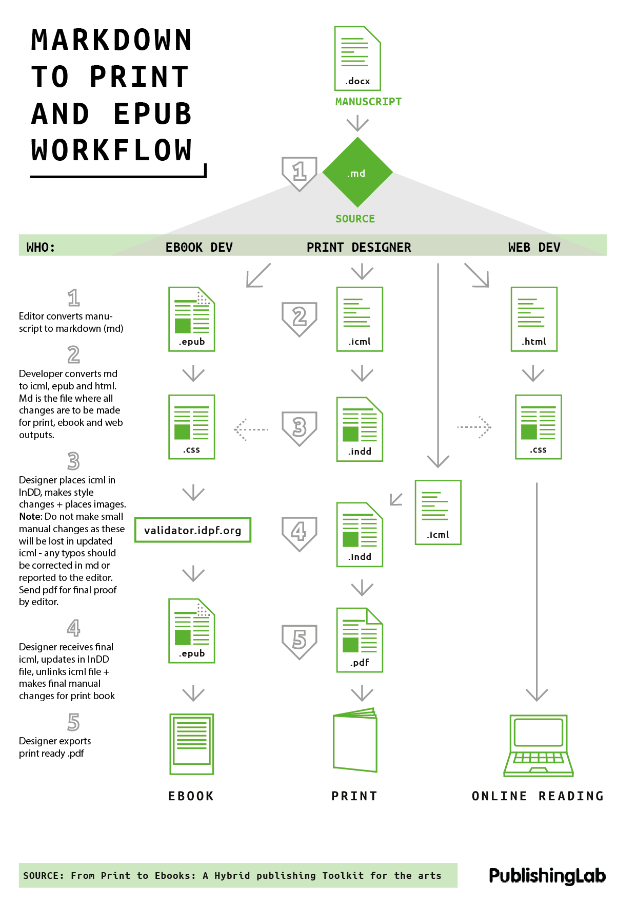

---
Pr-id: Designer's How To
P-id: PublishingLab Reader
A-id: 01
Type: article
Book-type: anthology
Anthology item: article
Item-id: unique no.
Article-title: title of the article
Article-status: accepted
Author: name(s) of author(s)
Author-email:   corresponding address
Author-bio:  about the author
Abstract:   short description of the article (100 words)
Keywords:   50 keywords for search and indexing
Rights: CC BY-NC 4.0
...

# Colophon

# Starting with InDesign & Icmls

by the PublishingLab

Welcome to the PublishingLab Workflow.

This is the bigger picture of how we create hybrid publications. All work starts from the source file (markdown), which is then converted to files suitable for web, print and ebooks.

As a designer, you follow the print branch of the workflow. Your styles defined for print influence the web and ebook output, so it has a consistent design look.

The diagram simplifies the process to 5 steps, however the steps below are more detailed for design work in InDesign.

## Steps:
1. File > Place the icml file in InDD
2. Edit > InCopy > Checkout (Checkout means you can make local changes, when you save & close your file you will 
3. Check your paragraph styles panel to see that the styles from your icml file have carried across, H1's should be labelled as H1/Header in your paragaph styles panel.
4. Make changes to the paragraph style and add images. **Note:** Don't make manual changes like fixing widows until the end of the process.
5. Send a .pdf to the editor to do final check. If you notice errors, please let the editor know so it can be corrected in the markdown file, don't correct it in InDesign because these changes will be lost when the icml is updated.
6. Save file, you will be asked if you want to 'check in' once you close InDD, click yes.
7. Once the editor has sent you the final, updated icml, you must relink the file (do this in the links panel or by clicking update link when you open InDD).
8. When you relink, the file will be updated, your styles will remain, but now you can unlink and make final manual changes like fixing widows or adding custom spaces.
9. Finish & send final pdf to editor/printer/publisher.

### Reference List
<a href="http://www.publishinglab.nl/blog/publication/from-print-to-ebooks-a-hybrid-publishing-toolkit-for-the-arts/">Book:</a> From Print to ePub: Hybrid Publishing for the Arts
