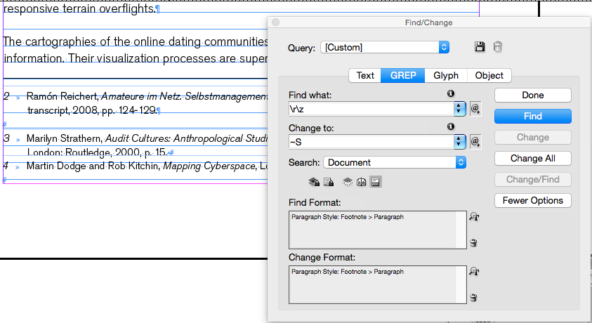

# InDesign Tips for Theory on Demand Publication

## Page breaks
You may want text to start on a new page, i.e. H1 headers may need to start on new pages, in this case you can insert a Break Character.

### How
Choose Type > Insert Break Character
Manually: On a Mac laptop where there is no dedicated Enter key - use Command + Fn + Return.

## Footnotes
**Rule**

footnote rule above - fix this in Type > Document Footnote options > rule above: continued footnotes

**Spacing in footnotes**

If you have a problem with a line space between footnotes creating too much space, you want to use the Find/Change function to fix these throughout the document. Show hidden characters to see if this is your problem, it will look like this, (on left between footnote 2 and 3):

### How
1. Open the Find/Change panel & use the GREP section.
You want to find an 'end of story marker' # need to use
find/change > combining \r\z with non-breaking space (~S) this solves it!
2. Click Find, and once you're satisfied it finds the right part in the footnotes (by selecting Find Format: Paragraph Style: Footnote>Paragraph) you can: 
3. Press Change or Change All
4. Press Done

Then go to the Footnote Options
In the Footnote Options panel > Layout, set the space between footnotes: 1mm.

**Note:** 

1. Make sure to check out linked icmls - or it say it can't find matches even when you can see them!
2. You can leave the Change Format panel it still fixes the space between issue.