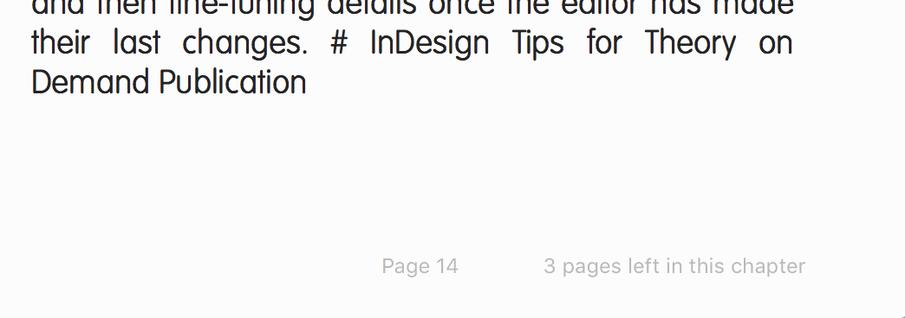

# Common errors md to ePub

## name of error: No rule to make target

**Translation:** 
Pandoc is expecting to find a file name ending in .md (markdown) but because of the space in the file name it stops.

> make: *** No rule to make target `md/Hybrid', needed by `epub'.  Stop.

This error is almost always caused by a typo - make sure your file has no spaces in the name. You can see it stopped after /Hybrid - which is the first word in the title below before a space.

### Solution

**Incorrect:**

Hybrid Publishing Workflow.md

**Correct:**

Hybrid-Publishing-Workflow.md

## pandoc: Could not parse YAML header: UnknownAlias {_anchorName = "The"} "source" (line 2259, column 1)

**Translation:**
Q: What does this error mean?
This error means something's gone wrong in the metadata section at the top of your file.

YAML is the language used for the metadata block in our Markdown source files. If there is an error in the metadata, pandoc will give this 'Could not parse YAML header' message. This is usually caused by spaces or characters being in the wrong place according to YAML's structure.

Pandoc has more about epub-metadata on:
<a href="http://pandoc.org/README.html#epub-metadata">http://pandoc.org/README.html#epub-metadata</a>.

There are a few things to be aware of:
line lengths - very long lines that go over 2+ lines need to have '[long line]' single quotes around them.

You can find out more about YAML on <a href="https://en.wikipedia.org/wiki/YAML">wikipedia</a>.

### Solution
You can use the YAML validator to help you find out more about your error using
<a href="http://www.yamllint.com/">yamllint.com</a>.
The issue can be caused by using markdown syntax in part of the md file that is meant to be YAML.

**incorrect**:
Abstract: * The Hackable City* is...

**correct**:
Abstract: The Hackable City is...

The difference here is that using single asterisks is a way to use markdown to make these words italic - unfortunately this is incorrect in YAML and will produce an error.

There is no one solution, but keep an eye out for weird syntax, and keep changing parts of the metadata in the validator until you've found the problem.

## C02Q52SEG8WM:HackableDEF-copy zylvj$ make book.epub
rm -f md/book.md  
rm -f book.epub 
rm -f *~ */*~  #emacs files
for i in md/HackableFINAL.md  ; \
	do ./scripts/md_stripmetada.py $i >> md/book.md ; \
	./scripts/md_urlize.py md/book.md ; \
	done
Traceback (most recent call last):
  File "./scripts/md_urlize.py", line 27, in <module>
    from django.utils.html import urlize
ImportError: No module named django.utils.html
make: *** [book.md] Error 1
C02Q52SEG8WM:HackableDEF-copy zylvj$ 

### solution
download & install django
or - remove this script for TOD and see if the book works without it

**Translation**
This script uses another program, django, but you don't have it installed on your computer.

## font problem: italic styles render in iBooks as bold italic

**Translation:**
The styles.epub.css file needs to be customised if you want to apply specific typefaces to your ePub. This means you need to use @font-face as well as listing your fonts in the src:

You also need to add a line of code to your makefile to embedd the fonts into the ePub.
--epub-embed-font=../lib/* \

### solution

The solution consists of 3 parts: make 2 changes to the css + 1 to the makefile.

#### css
**incorrect:**
@font-face {
src: Open Sans-LightItalic; format('opentype');
}

**correct:**

@font-face {
  font-family: 'OpenSans-LightItalic';
  font-style: italic;
  font-weight: 300;
  src: local('Open Sans Light Italic'), local('OpenSansLight-Italic'), url(open-sans-v13-latin-300italic.woff) format('woff');
  src: local('Open Sans Light Italic'), local('OpenSansLight-Italic'), url(open-sans-v13-latin-300italic.ttf) format('truetype');
  unicode-range: U+0000-00FF, U+0131, U+0152-0153, U+02C6, U+02DA, U+02DC, U+2000-206F, U+2074, U+20AC, U+2212, U+2215, U+E0FF, U+EFFD, U+F000;
}

**incorrect:**
not specifying a style for italic

**correct:**
p.italic {
    font-family: "OpenSans-LightItalic";
    font-style: italic;
}

#### make file
**incorrect:**

not having --epub-embed-font in your makefile means default fonts will be used.

**correct:**
--epub-embed-font=../lib/* \

## how to make a border box for some content
**Translation** 
There is content in the book with statistics/info that needs to be inside a box. We have created css styles for this with a class="statbox", indicate it in your markdown file and it will be styled according to the css.

### solution

this is a statbox in md

27% of people believe made-up statistics.
This statistic is 90% made-up.

**css**
.statbox {
    font-size: 0.75em;
    font-family: 'OpenSans-Light';
      border: 1px solid black;
      padding: 20px;
      outline: black solid 1px;
      outline-offset: 5px;
      margin-top: 2em;
      margin-bottom: 1em;
    }

## footnotes repeated or not formatted

**Translation**

### solution
??

## Fonts
Optional fonts:

    lib/ - folder for storing custom fonts, that will be used in the EPUB

Note on the use of custom fonts: If you choose to use fonts, make sure to change the makefile to include the use of fonts in the makefile epub rule, such as in the rule bellow, where --epub-embed-font=lib/UbuntuMono-B.ttf \ was added to allow for the use of the Ubuntu Mono font. Also include the font on th EPUB style-sheet with @font-face rule

## Fonts not rendering
**Translation**
Instead of seeing the custom font I've chosen for the book, I see a default. You need to reference the fonts you use in the .css file and in the makefile - the line below tells the makefile to embed this font in the ePub file.

Check your css to see that the src of your custom fonts is linked to the correct folder, which should be called 'lib'.

### solution
Check your makefile under **epub:** section you need to include
--epub-embed-font=../lib/* \

#### css
**incorrect**
@fontface
...
src: url('../fonts/open-sans-v13-latin_latin-ext-300.eot'); 

**correct**
src: url('../lib/open-sans-v13-latin_latin-ext-300.eot'); 

## My book is called 'Main Title'
**Translation**
You need to update the metadata.xml file so that your ePub has the right title, author, isbn and other important info related to it. This is a good indicator it hasn't been updated and is showing the default placeholder text.

### solution
Open the metadata.xml file inside the epub folder and update the details. You can find a more info about metadata here: <a href="http://www.publishinglab.nl/blog/2015/09/25/metadata-schmetadata-whats-it-good-for/">http://www.publishinglab.nl/blog/2015/09/25/metadata-schmetadata-whats-it-good-for/</a>

## command line - when using pandoc to create epubs

**Translation:**
Pandoc is a converter, you need to first install it

### solution
a guide to set it up & use it to recreate files

## The Table of Contents doesn't show all my chapters (marked by # H1 syntax)

**Translation**
The ePub is not rendering the # as H1 header markup, and instead probably just thinks you mean hashtag.

The issue looks like this:

### solution
Make sure all your files have an empty line at the end, otherwise when book.md is created (which combines all the md files) it just reads the first # as a continuation of the sentence before.

For example, if you have 3 chapters and only 2 show, check the end of chapter 2 and add a line space after the last sentence. Create ePub again, this should fix the problem.

## The ePub has all the content twice

**Translation**
It's likely there is a tmp.md file in the md folder with your other files, when you make an ePub using the make file a book.md file is generated which combines all the .md files and it is including this tmp.md folder unncessarily. It is safe to remove it and then you'll have the content displayed just once.

### solution

delete the template.md or tmp.md file 