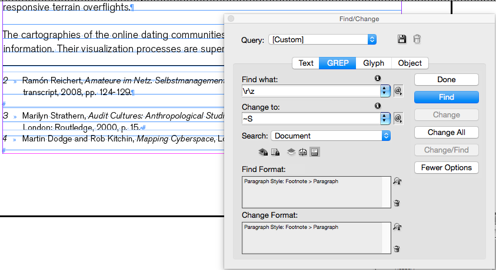

# Colophon

# Starting with InDesign & Icmls

by the PublishingLab

Welcome to the PublishingLab Workflow.

This is the bigger picture of how we create hybrid publications. All work starts from the source file (markdown), which is then converted to files suitable for web, print and ebooks.

As a designer, you follow the print branch of the workflow. Your styles defined for print influence the web and ebook output, so it has a consistent design look.

The diagram simplifies the process to 5 steps, however the steps below are more detailed for design work in InDesign.

## Steps:
1. File > Place the icml file in InDD
2. Edit > InCopy > Checkout (Checkout means you can make local changes, when you save & close your file you will 
3. Check your paragraph styles panel to see that the styles from your icml file have carried across, H1's should be labelled as H1/Header in your paragaph styles panel.
4. Make changes to the paragraph style and add images. **Note:** Don't make manual changes like fixing widows until the end of the process.
5. Send a .pdf to the editor to do final check. If you notice errors, please let the editor know so it can be corrected in the markdown file, don't correct it in InDesign because these changes will be lost when the icml is updated.
6. Save file, you will be asked if you want to 'check in' once you close InDD, click yes.
7. Once the editor has sent you the final, updated icml, you must relink the file (do this in the links panel or by clicking update link when you open InDD).
8. When you relink, the file will be updated, your styles will remain, but now you can unlink and make final manual changes like fixing widows or adding custom spaces.
9. Finish & send final pdf to editor/printer/publisher.

### Reference List
<a href="http://www.publishinglab.nl/blog/publication/from-print-to-ebooks-a-hybrid-publishing-toolkit-for-the-arts/">Book:</a> From Print to ePub: Hybrid Publishing for the Arts

# Common errors icml to InDesign

versions tested: InDD CC, InDD CS6, InDD CS5.5

## I cannot apply styles or make manual edits after placing the icml file

**Translation:**

This is likely because your icml file has not been "checked out" - this means that the incopy file is able to be edited by everyone, but restricts edits to what's already been marked up in the document.
To make manual edits and add images, you need to check out. When saving the file, InDD will ask you to check back in, say yes.

### solution
edit > incopy > checkout (Command+F9)

## When updating the linked icml file, the manual changes & images disappeared

**Translation**

This will happen. Manual changes, like fixing widows or orphans, need to be left until the end when the editor has submitted the absolutely final file. For the first design draft, it's important to include images in the correct position in the content, however please note that they will need to be relinked in InDD when you have the final icml file.

### solution
Image frames will have a little crossed pencil icon, double click this to relink to the image.

For the last design, wait until you have the final icml file from the editor so that you can UNLINK your InDD document, finish manual edits and create a .pdf.

## New paragraph styles I created were no longer applied to the text when updating the icml file

**Translation**

The icml files contain markup in the form of headers, paragraphs, blockquotes, footnotes and tables. The editor's role is to assign this markup to the content (md file) before you receive the icml. If you notice there are some headers missing for instance, please inform the editor so he can fix the file. Note: In the case of the author name - which has a special class, you will have to create a paragraph style for author & apply it twice: in the first round and in the final updated InDD file. This should be the only instance of repeated paragraph styling.

### solution
Create the new paragraph styles necessary (ie author name), inform the editor of any un-marked headers, blockquotes etc, and wait for the final icml file. 

## I was working on the InDD file and at some point couldn't make any more manual changes

**Translation**

The cause of this issue may be because of an idlk file. InDesign Lockfile is generated by InDesign as soon as you open an InDD file, this is to prevent someone else opening the same file and making changes simultaneously. It is possible that while you were working on an InDD file, someone else opened it and somehow you are 'locked out'. 

### solution
Move the idlk file to the trash. 

## What do these InDD symbols mean?

globe+arrow: indicate anyone can edit in InCopy
crossed pencil: indicates missing link to an image/text, equivalent to the ? icon that indicates missing links

## No styles are attributed to text after I place icml file

**Translation**

This shouldn't happen...
doesn't happen with InDD CC,
does happen with CS5.5

### solution
Editor should check the markdown file has been correctly formatted, ie # = header 1, and test the icml file before sending to designer. Designer to send screenshots of the problem to Editor for problem-solving + tell the editor the InDD version you are working with.

## when I place the icml, it all looks like default styling

**Translation**

InDesign should automatically create all the Paragraph and Character styles named in the .icml (based on what you had in the HTML, including class names for paragraphs and spans). But in a new InDesign doc, they may show default fonts, so you'll need to spend some time defining the style attributes in the InDesign document.

### solution

Check out the icml file and spend some time defining the style attributes in the paragraph styles panel.

Or place the icml files into an InDesign template (.indt) file you've already set up. The paragraph styles will be applied and you will just need to check they're consistently applied.

## FAQ: Footnotes: some are long and flow over two pages, but the line above is not the same on both pages.

**Translation**

The inDD template file we provide you with shouldn't show this problem, but it just means the footnote style is only being applied to the first page of the footnote.

### solution
You will need to go Type > Document Footnote options >Layout > Rule above, select the continued footnote options. This means whenever there's a long footnote the same style applies over both pages.

## FAQ: Why is there a tmp.icml file in the folder?

**Translation**

A TMP file is just a temporary file that's automatically created as you make a new file, you can safely ignore it.

## FAQ: There's an unassigned icml in my assignments panel, will this affect my workflow?

**Translation**

In InDesign, assignment files are containers for organizing collections of page items. For example, you might want to select all the items in a story (headline, byline, copy, graphics, and captions), and then assign them to one InCopy user. Adding those items to an assignment provides a convenient way for InCopy users to access only the content for which they are responsible. Only InDesign users can create assignment files; only InCopy users can open them.
You will not be assigning items with the HPToolkit Workflow, so it's safe to ignore.

### Solution
We aren't using an InCopy to InDesign workflow, so this will not affect your ability to work on the file. The crossed pencil means the file needs to be accessed via InCopy. Ignore it.

## What is the designer's role in the PL workflow?

We have a diagram explaining the workflow <a href="ch001.xml">here</a> but the designer creates the final book and influences the visual outcome of all three mediums: print, ebooks and web (if the book is created in html). The styles the designer chooses are important, and there will need to be a collaborative relationship between the designer, editor and developer.

The copy editor will start by making changes to the original docx file, then the editor checks edits in the markdown file. That markdown file is converted to an icml and laid out in InDesign. Once the document has all the images in and all paragraph styles decided a .pdf proof is sent to the editor. The editor can print this and make final changes, which will be updated in the markdown before a new icml is made and the designer can finish by updating their file, unlinking it and making the final manual changes necessary.

**Translation**

This means the designer engages with the content twice: broadly creating the layout using the first icml text and then fine-tuning details once the editor has made their last changes.

# InDesign Tips for Theory on Demand Publication

## Page breaks
You may want text to start on a new page, i.e. H1 headers may need to start on new pages, in this case you can insert a Break Character.

### How
Choose Type > Insert Break Character
Manually: On a Mac laptop where there is no dedicated Enter key - use Command + Fn + Return.

## Footnotes
**Rule**

footnote rule above - fix this in Type > Document Footnote options > rule above: continued footnotes

**Spacing in footnotes**

If you have a problem with a line space between footnotes creating too much space, you want to use the Find/Change function to fix these throughout the document. Show hidden characters to see if this is your problem, it will look like this, (on left between footnote 2 and 3):

### How
1. Open the Find/Change panel & use the GREP section.
You want to find an 'end of story marker' # need to use
find/change > combining \r\z with non-breaking space (~S) this solves it!
2. Click Find, and once you're satisfied it finds the right part in the footnotes (by selecting Find Format: Paragraph Style: Footnote>Paragraph) you can: 
3. Press Change or Change All
4. Press Done

Then go to the Footnote Options
In the Footnote Options panel > Layout, set the space between footnotes: 1mm.

**Note:** 

1. Make sure to check out linked icmls - or it say it can't find matches even when you can see them!
2. You can leave the Change Format panel it still fixes the space between issue.
